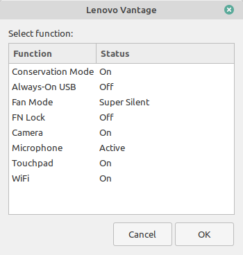

# Lenovo Vantage for Linux
This shell script helps you to provide [Lenovo Vantage](https://www.lenovo.com/us/en/software/vantage) in GNU/Linux operating system.

## :rocket: Features

* Conservation Mode (Limit battery charge to prolong its life)
* Always-On USB (Enable USB power output when the system is in low-power modes)
* Thermal/Fan Mode (Quiet, balanced and performance modes)
* FN Key Lock
* Camera Privacy Switch
* Microphone Privacy Switch
* Touchpad Switch
* Wi-Fi Switch

## :computer: Installation

First of all, you need to clone the repository with this command:
```bash
git clone https://github.com/niizam/vantage.git
cd vantage
```
Then you can easily run this command:

```bash
sudo make install
```
Run "Lenovo Vantage" from your applications list.

## :hotsprings: Uninstall
To uninstall Lenovo Vantage, you can just run this:

```bash
sudo make uninstall
```

## :warning: Requirements
* `zenity`
* `xorg-xinput` or `xinput`
* `networkmanager`
* `pulseaudio` or `pipewire-pulse`


if they are not already installed, you can install them using your package manager.

For Arch Linux:
```bash
sudo pacman -S zenity xorg-xinput networkmanager
``` 
For Debian derivatives (Ubuntu, Mint, Pop!_OS, etc):
```bash
sudo apt install zenity xinput
```
For Fedora:
```bash
sudo dnf install zenity xinput NetworkManager pipewire-pulseaudio
```
---
